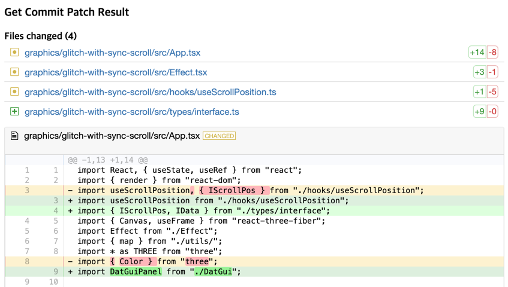

# 365 Days of Commit

> Code anywhere, Commit everyday. My personal coding challenge for 2020.

**Day 0: December 31, 2019**

2020 is just starting tomorrow. I'm having mixed feelings about it. This is the year I will be in my 30s and at the same time my salary will be frozen due to company circumstances. Well...so I decided to make some slight changes in my life. I will **commit** and **push** code to my github repository, and **write** what I did at here **every single day** in this year. The code will be mainly related to my interests or my personal projects, and I will try not to bring the code at work here. All kinds of feedback like comments and PR are always welcome, and please point out if there is a grammar error, since English is not my native language. This project is highly inspired by the daily coding project called **[100-days-of-code](https://github.com/kallaway/100-days-of-code)**.

---

## Table of Contents

| Day                               |                                            Focus | Day                               |                                                 Focus |
| :-------------------------------- | -----------------------------------------------: | :-------------------------------- | ----------------------------------------------------: |
| [Day 1](#day-1)<br>**01/01/20**   |                           **_SWR_**<br>React, TS | [Day 2](#day-2)<br>**01/02/20**   |                        **_SWR_**<br>Suspense, GraphQL |
| [Day 3](#day-3)<br>**01/03/20**   |             **_GlitchFilter_**<br>React, Flutter | [Day 4](#day-4)<br>**01/04/20**   |                   **_react-three-fiber_**<br>Graphics |
| [Day 5](#day-5)<br>**01/05/20**   |                             **_Hooks_**<br>React | [Day 6](#day-6)<br>**01/06/20**   |           **_react-three-fiber_**<br>Shader, Three.js |
| [Day 7](#day-7)<br>**01/07/20**   |                   **_MethodChannel_**<br>Flutter | [Day 8](#day-8)<br>**01/08/20**   | **_react-three-fiber_**<br>EffectComposer, GlitchPass |
| [Day 9](#day-9)<br>**01/09/20**   |         **_react-dat-gui_**<br>Graphics, dat.GUI | [Day 10](#day-10)<br>**01/10/20** |                           **_GlitchPass_**<br>Flutter |
| [Day 11](#day-11)<br>**01/11/20** |                          **_Github API_**<br>SWR | [Day 12](#day-12)<br>**01/12/20** |                           **_Github API_**<br>GraphQL |
| [Day 13](#day-13)<br>**01/13/20** |   **_diff2html_**<br>Github API v3, diff & patch | [Day 14](#day-14)<br>**01/14/20** |                         **_diff2html_**<br>Media Type |
| [Day 15](#day-15)<br>**01/15/20** | **_Documentation_**<br>Sprite, react-three-fiber | [Day 16](#day-16)<br>**01/16/20** |                 **_cron_**<br>Github API, Node.js, TS |
| [Day 17](#day-17)<br>**01/17/20** |            **_cron_**<br>Github API, Node.js, TS | [Day 18](#day-18)<br>**01/18/20** |         **_Github OAuth_**<br>Github API, Node.js, JS |
| [Day 19](#day-19)<br>**01/19/20** |    **_GitHub OAuth_**<br>Github API, Node.js, JS | [Day 20](#day-20)<br>**01/20/20** |                   **_Push Notification_**<br>Firebase |
| [Day 21](#day-21)<br>**01/21/20** |              **_Push Notification_**<br>Firebase | [Day 22](#day-22)<br>**01/22/20** |          **_Push Notification_**<br>Firebase, Express |
| [Day 23](#day-23)<br>**01/23/20** |               **_Push Notification_**<br>Postman | [Day 24](#day-24)<br>**01/24/20** |         **_Github OAuth_**<br>Github API, Node.js, TS |
| [Day 25](#day-25)<br>**01/25/20** |                  **_PWA_**<br>HTTPS, Development | [Day 26](#day-26)<br>**01/26/20** |      **_Github OAuth_**<br>Github API, Node.js, React |
| [Day 27](#day-27)<br>**01/27/20** |               **_react-hook-form_**<br>React, TS | [Day 28](#day-28)<br>**01/28/20** |                           **_react-hook-form_**<br>PR |

---

<a name="day-1"></a>

### Day 1: January 1, 2020 (Wed)

**Today's Focus**: Learn and code [SWR](https://swr.now.sh/).

**Details**:

- Recently I heard a lot about a stack called [SWR](https://swr.now.sh/), a React Hooks library for remote data fetching. It has a lot of feature that I want, such as caching, revalidation, and local mutation for optimistic UI. (looks similar to Apollo...) So I decided to learn it.
- Today, I tried to read the document and write basic data fetching and global configuration code.
- I made a repo called [doodles](https://github.com/30in2020/doodles). All the code from my personal study will be uploaded here.

**Commits**:

| Message                                                                                                                                   | Tags                         |
| ----------------------------------------------------------------------------------------------------------------------------------------- | ---------------------------- |
| [Feat: create swr-experiment directory](https://github.com/30in2020/doodles/commit/e6bd9624509fcfdfab2ec55d0785be78d6352c64)              | `Boilerplate`                |
| [Feat: try global config and data-fetch code of SWR](https://github.com/30in2020/doodles/commit/afe76513f98dd8f07027e68efb2444acba91013b) | `SWR`, `React`, `Typescript` |
| Chore: Add README.md                                                                                                                      | `Documentation`              |

**Links to work**:

- [Main repository](https://github.com/30in2020/doodles/tree/master/react/swr-experiment)

**Reference**:

- [SWR - Github Repository](https://github.com/zeit/swr)

---

<a name="day-2"></a>

### Day 2: January 2, 2020 (Thu)

**Today's Focus**: Continue learning [SWR](https://swr.now.sh/) library.

**Details**:

- Tried to use React.Suspense mode with [SWR](https://swr.now.sh/). By just passing `suspense: true` to useSWR's option parameter, it enabled me to use the mode.
- Also tried data fetching using GraphQL. Used [GraphQLZero](https://graphqlzero.almansi.me/) for implementing fake APIs.

**Commits**:

| Message                                                                                                                                    | Tags                                                      |
| ------------------------------------------------------------------------------------------------------------------------------------------ | --------------------------------------------------------- |
| [Feat: use graphql fetching and suspense mode of swr](https://github.com/30in2020/doodles/commit/6f3a776a0b6f2e6fbd55bab48bf6055fdab945b3) | `SWR`, `React`, `GraphQL`, `React.Suspense`, `Typescript` |

**Links to work**:

- [Main repository](https://github.com/30in2020/doodles/tree/master/react/swr-experiment)

**Reference**:

- [SWR - Github Repository](https://github.com/zeit/swr)

---

<a name="day-3"></a>

### Day 3: January 3, 2020 (Fri)

**Today's Focus**: Learn how to make WebGL glitch effect with scroll interaction. Search a shader sample to use.

**Details**:

[](https://monokai.nl/2019/japan/)

> [Monokai: A trip through Japan](https://monokai.nl/2019/japan/)

- I found a cool project called 'A trip through Japan'. I love the way it uses shader effects for the character animation on background. I don't know the specific name of shaders, but it seems like using glitch and noise shader...just my assumption.
- Checked with the inspector and realized that the letters in front ('Tokyo' and caption) and behind (kanji) are separated into different layers. The former is DOM, and the latter is canvas using WebGL.
- With reference to this artwork, I'm going to make a similar one. (Instead, I wanted to make it using React as a precondition.) I searched the shader samples and found a good one I was looking for: [GlitchFilter](https://github.com/pixijs/pixi-filters/tree/master/filters/glitch) of [Pixi.js](https://www.pixijs.com/). I need to modify the original code to use it on react environment. I will do it tomorrow...
- By the way, today there was a first pull request from this account. 🎉

**Commits**:

| Message                                                                                                                               | Tags                             |
| ------------------------------------------------------------------------------------------------------------------------------------- | -------------------------------- |
| [Feat: create glitch-with-sync-scroll directory](https://github.com/30in2020/doodles/commit/83e19350868533ec41307183dd2acb6f3ee516d3) | `Boilerplate`                    |
| [Feat: add PixiJS's GlitchFilter module](https://github.com/30in2020/doodles/commit/c4e8bdd162bf6a6b9a3ecc038c2333f7d43ce87a)         | `Graphics`, `Shader`, `WebGL`    |
| [Update unused method name in docs](https://github.com/30in2020/website/commit/e88a51fa08ac71d89a796a8498852ba5ca625ff4)              | `PR`, `Documentation`, `Flutter` |

**Links to work**:

- [Main repository](https://github.com/30in2020/doodles/tree/master/graphics/glitch-with-sync-scroll)

**Reference**:

- [Monokai: A trip through Japan](https://monokai.nl/2019/japan/)
- [Pixi filter Demo](https://pixijs.io/pixi-filters/tools/demo/)

---

<a name="day-4"></a>

### Day 4: January 4, 2020 (Sat)

**Today's Focus**: Find a React renderer modules for three.js.

**Details**:

- There was a lot of three.js module using React, such as `react-three`, `react-three-renderer`, and `react-three-fiber`. I chose [`react-three-fiber`](https://github.com/react-spring/react-three-fiber) because it works fine in React v16, and it comes with a lot of hooks already.

**Commits**:

| Message                                                                                                                          | Tags                                             |
| -------------------------------------------------------------------------------------------------------------------------------- | ------------------------------------------------ |
| [Feat: add react-three-fiber, three module](https://github.com/30in2020/doodles/commit/6a3d0f70b38b83d74587296ca4de490eb134da2c) | `react-three-fiber`, `Boilerplate`, `Typescript` |

**Links to work**:

- [Main repository](https://github.com/30in2020/doodles/tree/master/graphics/glitch-with-sync-scroll)

**Reference**:

- [react-three-fiber: repository](https://github.com/react-spring/react-three-fiber)
- [Tutorial: react-three-fiber & typescript starter code](https://codesandbox.io/s/react-three-fiber-ho4i8?from-embed)
- [Tutorial: Write three.js in React Using react-three-fiber](https://alligator.io/react/react-with-threejs/)

---

<a name="day-5"></a>

### Day 5: January 5, 2020 (Sun)

**Today's Focus**: Add `useScrollPosition` hook.

**Details**:

- Added `useScrollPosition` hook, referring to [this article](https://dev.to/n8tb1t/tracking-scroll-position-with-react-hooks-3bbj). I learned some facts about Hooks which I didn't usually know, such as the difference between `useEffect` and `useLayoutEffect`, and when to use `useRef` instead of `useState`.
  - `useEffect` runs asynchronously and after a render is painted to the screen. That goes:
    1. You cause a render somehow (change state, or the parent re-renders)
    2. React renders your component (calls it)
    3. The screen is visually updated
    4. THEN useEffect runs
  - `useLayoutEffect` runs synchronously after a render but before the screen is updated. That goes:
    1. You cause a render somehow (change state, or the parent re-renders)
    2. React renders your component (calls it)
    3. useLayoutEffect runs, and React waits for it to finish.
    4. The screen is visually updated
  - According to React Hooks reference guide, `useRef` is useful for more than the ref attribute. It’s handy for keeping any mutable value around similar to how you’d use instance fields in classes. If you want to use a stateful value that won't trigger re-render on each state change, use `useRef`.
- Refactored the `GlitchFilter` code to make it usable with React context.

**Commits**:

| Message                                                                                                                                          | Tags                           |
| ------------------------------------------------------------------------------------------------------------------------------------------------ | ------------------------------ |
| [Feat: add useScrollPosition hook](https://github.com/30in2020/doodles/commit/a7b5fadee271ad44f101b494bac8234c34a43ee4)                          | `Hooks`, `React`, `Typescript` |
| [Refactor: make the GlitchFilter usable with React context](https://github.com/30in2020/doodles/commit/e6a54515e88c80dc58e911304a3a57ad53aa0521) | `Graphics`, `Shader`, `WebGL`  |

**Links to work**:

- [Main repository](https://github.com/30in2020/doodles/tree/master/graphics/glitch-with-sync-scroll)

**Reference**:

- [Article: When to useLayoutEffect Instead of useEffect](https://daveceddia.com/useeffect-vs-uselayouteffect/)
- [Tutorial: Tracking Scroll Position With React Hooks](https://dev.to/n8tb1t/tracking-scroll-position-with-react-hooks-3bbj)

---

<a name="day-6"></a>

### Day 6: January 6, 2020 (Mon)

**Today's Focus**: Learn how to use `react-three-fiber` with shaders.

**Details**:

- It seems that `react-three-fiber` makes me deal with three.js code 'more React way'. Thanks to `extend` function, I could write the shader code in JSX like I was coding a normal react component. Also, it seems that I can pass uniform parameter by just giving prop data to shader components. Needs more research...

**Commits**:

| Message                                                                                                                    | Tags                                                 |
| -------------------------------------------------------------------------------------------------------------------------- | ---------------------------------------------------- |
| [Feat: add EffectComposer and passes](https://github.com/30in2020/doodles/commit/7ee9fd369b1389ce4d67cf0977e169340ae95065) | `Graphics`, `Shader`, `WebGL`, `React`, `Typescript` |

**Links to work**:

- [Main repository](https://github.com/30in2020/doodles/tree/master/graphics/glitch-with-sync-scroll)

**Reference**:

- [Code: Three.js's GlitchPass](https://github.com/mrdoob/three.js/blob/27811881f61e647ae2b8b009e3032f62739c2c25/examples/js/postprocessing/GlitchPass.js#L75)

---

<a name="day-7"></a>

### Day 7: January 7, 2020 (Tue)

**Today's Focus**: Learn `MethodChannel` of `Flutter` by reading official documents.

**Details**:

- Learned about the fundamentals of `MethodChannel` of `Flutter`. `MethodChannel` makes it possible to communicate between Flutter and native code.
- The implementation of `MethodChannel` varies depending on the package. According to official documents, in case of `Android`, implementing MethodChannel logic inside the `configureFlutterEngine()` is recommended. Some of the documents were out of sync with the latest version, so I fixed it and sent PR.

**Commits**:

| Message                                                                                                                         | Tags                             |
| ------------------------------------------------------------------------------------------------------------------------------- | -------------------------------- |
| [Fix: update unused argument name in docs](https://github.com/30in2020/website/commit/65be9647e1fef53a9d8539d73cae2067ef06aa10) | `PR`, `Documentation`, `Flutter` |

**Links to work**:

- [Main repository](https://github.com/30in2020/website/tree/patch-1)

**Reference**:

- [Document: Writing custom platform-specific code](https://flutter.dev/docs/development/platform-integration/platform-channels?tab=android-channel-java-tab)

---

<a name="day-8"></a>

### Day 8: January 8, 2020 (Wed)

**Today's Focus**: Learn how to change(and animate) shader values of post-processing filters using `react-three-fiber`.

**Details**:


> Animated GIF showing the sample I made today.

- Few days ago, I tried to modify the [GlitchFilter](https://github.com/pixijs/pixi-filters/tree/master/filters/glitch) code to use this filter in React environment, but I decided to try it after studying more. I don't think I can do it right now because I'm stuck in the basics. Instead, I used `GlitchPass` (and also `FilmPass`, `HalftonePass`) that were built in Three.js.
- Learned how to change shader's uniform value when using `react-three-fiber`. Pass the value to `uniform-${uniform_variable_name}-value` prop of Pass components, like this:

  ```html
  <effectComposer ref="{composer}" args="{[gl]}">
    <renderPass attachArray="passes" scene="{scene}" camera="{camera}" />
    <glitchPass attachArray="passes" x renderToScreen />
    <halftonePass
      attachArray="passes"
      uniforms-blending-value="{1}"
      renderToScreen
    />
    <filmPass
      uniforms-grayscale-value="{0}"
      attachArray="passes"
      renderToScreen
    />
  </effectComposer>
  ```

**Commits**:

| Message                                                                                                                                                    | Tags                                                 |
| ---------------------------------------------------------------------------------------------------------------------------------------------------------- | ---------------------------------------------------- |
| [Feat: make it possible to control shader parameters by scroll event](https://github.com/30in2020/website/commit/09bf52bc32c4b09f3ac25e53db7a7ccad70148a1) | `Graphics`, `Shader`, `WebGL`, `React`, `Typescript` |

**Links to work**:

- [Main repository](https://github.com/30in2020/doodles/tree/master/graphics/glitch-with-sync-scroll)

**Reference**:

- [Example: Sample of react-three-fiber](https://github.com/react-spring/react-three-fiber/blob/master/examples/demos/dev/Scroll.js)
- [Document: EffectComposer and Pass examples](https://threejs.org/docs/#examples/en/postprocessing/EffectComposer)
- [Tutorial: Three.js Post Processing](https://threejsfundamentals.org/threejs/lessons/threejs-post-processing.html)

---

<a name="day-9"></a>

### Day 9: January 9, 2020 (Thu)

**Today's Focus**: Add `react-dat-gui` to make it possible to control shader parameters by using `dat.GUI`.

**Details**:

- To control shader parameters by GUI, I tried `react-dat-gui` library, the React version of `dat.GUI`. (`dat.GUI` is commonly used in the Three.js project.)
- First I installed this module using npm. However, the released version on npm did not contain the index.d.ts file, causing a complie error. Be cafeful!

**Commits**:

| Message                                                                                                                                      | Tags                              |
| -------------------------------------------------------------------------------------------------------------------------------------------- | --------------------------------- |
| [Feat: add react-dat-gui module and make DatGuiPanel](https://github.com/30in2020/doodles/commit/4def5ce850f09031a1a8da348dd231aa9a6f7899)   | `Graphics`, `React`, `Typescript` |
| [Feat: make it possible to control params using DatGui](https://github.com/30in2020/doodles/commit/c8a177cdb894d19b9fcfdad223a76bb4c64c1bb7) | `Graphics`, `React`, `Typescript` |

**Links to work**:

- [Main repository](https://github.com/30in2020/doodles/tree/master/graphics/glitch-with-sync-scroll)

**Reference**:

- [Repo: react-dat-gui](https://github.com/claus/react-dat-gui)
- [issue: react-dat-gul - index.d.ts is not published to npm](https://github.com/claus/react-dat-gui/issues/42)

---

<a name="day-10"></a>

### Day 10: January 10, 2020 (Fri)

**Today's Focus**: Make it possible to control GlitchPass by using dat.GUI. (not finished yet...)

**Details**:

- Added the uniform values of `GlitchPass` to `dat.GUI`. Unfortunately, because I've deleted all the random values in `GlitchPass.render`, the effect animation looks like broken. Need to fix it tomorrow...
- Also, I learned how to get a flutter app to communicate with webview in both directions. It uses `webview_flutter` and `JavascriptChannel`. I will upload the code about this in a few days.

**Commits**:

| Message                                                                                                                       | Tags                              |
| ----------------------------------------------------------------------------------------------------------------------------- | --------------------------------- |
| [Feat: add GlitchPass params to dat.GUI](https://github.com/30in2020/doodles/commit/a6e58203b3f985cdcd432e1aa7a95328392973b3) | `Graphics`, `React`, `Typescript` |
| [Fix: update unused names in docs](https://github.com/30in2020/website/commit/e3b0754eb8ecf7d7ee15134785dcaccb15915d41)       | `PR`, `Documentation`, `Flutter`  |

**Links to work**:

- [Main repository](https://github.com/30in2020/doodles/tree/master/graphics/glitch-with-sync-scroll)

**Reference**:

- [Repo: react-dat-gui](https://github.com/claus/react-dat-gui)

---

<a name="day-11"></a>

### Day 11: January 11, 2020 (Sat)

**Today's Focus**: try Github GraphQL API v4

**Details**:

- Tried using Github API v4. Unlike the previous version, it uses GraphQL.
- Using the `SWR` I used last time, I'm going to make a sample code fetching various data of Github.

**Commits**:

| Message                                                                                                                     | Tags                                           |
| --------------------------------------------------------------------------------------------------------------------------- | ---------------------------------------------- |
| [Feat: create github-api-v4 directory](https://github.com/30in2020/doodles/commit/ea6b121bb5a2ea47432ea3ce4d1af7ce01c41750) | `Github API`, `React`, `Typescript`            |
| [Feat: try Github API's graphql query](https://github.com/30in2020/doodles/commit/829cb2371aedafd6abf3f2019f89959db336f4ac) | `Github API`, `GraphQL`, `React`, `Typescript` |

**Links to work**:

- [Main repository](https://github.com/30in2020/doodles/tree/master/react/github-api-v4)

**Reference**:

- [Document: Github GraphQL API v4](https://developer.github.com/v4/guides/forming-calls/#authenticating-with-graphql)
- [Github GraphQL API Explorer](https://developer.github.com/v4/explorer/)

---

<a name="day-12"></a>

### Day 12: January 12, 2020 (Sun)

**Today's Focus**: Write some sample codes of Github GraphQL API v4

**Details**:

- Finally I managed to get right data using Github GraphQL API v4. I wrote some sample codes, such as fetching pinned repositories, the information of repositories, commit history, and PR list.
- It seems there is no API for getting files' patch history in API v4. If I want to get modified file list, I think I should use the previous version.

**Commits**:

| Message                                                                                                                           | Tags                                           |
| --------------------------------------------------------------------------------------------------------------------------------- | ---------------------------------------------- |
| [Feat: add Github GraphQL API fetch samples](https://github.com/30in2020/doodles/commit/eccd656ee384a906b91ecf3c227bdbe2b4d833c8) | `Github API`, `GraphQL`, `React`, `Typescript` |

**Links to work**:

- [Main repository](https://github.com/30in2020/doodles/tree/master/react/github-api-v4)

**Reference**:

- [Document: Github GraphQL API v4](https://developer.github.com/v4/guides/forming-calls/#authenticating-with-graphql)
- [Github GraphQL API Explorer](https://developer.github.com/v4/explorer/)
- [stackoverflow: Get commit changed files & patch using github API v4 graphQL](https://stackoverflow.com/questions/58058535/get-commit-changed-files-patch-using-github-api-v4-graphql)

---

<a name="day-13"></a>

### Day 13: January 13, 2020 (Mon)

**Today's Focus**: Using Github GraphQL API v4, REST API v3, and `diff2html` library

**Details**:

- Using GraphQL API v4, now I can fetch the ratio of languages used in one repository. It has two interger parameter called `totalSize` and `size`, so I can calculate the ratio of languages by using these values. Also, I used REST API v3 for getting a patch string of single commit.
- I wanted to show the patch/diff string beautifully, so I decided to use `diff2html` library but because of some unexpected errors, it didn't worked well. I'll fix this tomorrow...

**Commits**:

| Message                                                                                                                                        | Tags                                             |
| ---------------------------------------------------------------------------------------------------------------------------------------------- | ------------------------------------------------ |
| [Feat: make it possible to get language ratio of repo](https://github.com/30in2020/doodles/commit/baae36a2dbb84cbd8d8a41dab3d0a08fd855fece)    | `Github API`, `GraphQL`, `React`, `Typescript`   |
| [Feat: add code getting a single commit with patch param](https://github.com/30in2020/doodles/commit/b5510626780d0a2b600536bf3955681acc9eefaf) | `Github API`, `GraphQL`, `React`, `Typescript`   |
| [Feat: install diff2html module](https://github.com/30in2020/doodles/commit/f10a079d0256a43a756a8a86e509ff1145e465b8)                          | `Github API`, `diff2html`, `React`, `Typescript` |

**Links to work**:

- [Main repository](https://github.com/30in2020/doodles/tree/master/react/github-api-v4)

**Reference**:

- [Document: Github GraphQL API v4](https://developer.github.com/v4/guides/forming-calls/#authenticating-with-graphql)
- [Document: Github REST API v3](https://developer.github.com/v3/repos/commits/#get-a-single-commit)
- [Repository: diff2html](https://github.com/rtfpessoa/diff2html/)

---

<a name="day-14"></a>

### Day 14: January 14, 2020 (Tue)

**Today's Focus**: Learn how to use `diff2html` and show modified file list.

**Details**:



> diff2html sample I made today

- Kept thinking about how to get the diff string of single commit. Finally I found the [`document about media type`](https://developer.github.com/v3/media/#diff). I could get the diff string by setting media type to `application/vnd.github.v3.diff`.
- Now I think the next mission is how to apply different color scheme to the code for each language.

**Commits**:

| Message                                                                                                                        | Tags                                             |
| ------------------------------------------------------------------------------------------------------------------------------ | ------------------------------------------------ |
| [Fix: show changed files using diff2html](https://github.com/30in2020/doodles/commit/646d4c302d47d1c28721d998ad8101a681fed88f) | `Github API`, `diff2html`, `React`, `Typescript` |

**Links to work**:

- [Main repository](https://github.com/30in2020/doodles/tree/master/react/github-api-v4)

**Reference**:

- [Document: Media Type](https://developer.github.com/v3/media/#diff)
- [Repository: diff2html](https://github.com/rtfpessoa/diff2html#diff2html-usage)

---

<a name="day-15"></a>

### Day 15: January 15, 2020 (Wed)

**Today's Focus**: Refactor codes in doodles/. Add Table of Contents in README.md.

**Details**:

- There were some module errors with the `glitch-with-sync-scroll` repo's code, so I fixed it.
- Also I added the text in the scene of `glitch-with-sync-scroll`. `Text()` function I added renders text via canvas and projects it as a sprite.
- Finally, to quickly find a content by keyword, I added Table of Contents on the top of the log file.

**Commits**:

| Message                                                                                                                                  | Tags                                   |
| ---------------------------------------------------------------------------------------------------------------------------------------- | -------------------------------------- |
| [Fix: fix module errors in react-dat-gui](https://github.com/30in2020/doodles/commit/40e73d13ad5bcb3ed927ee893bf90c6b80234eb9)           | `react-dat-gui`, `React`, `Typescript` |
| [Feat: add text element in react-three-fiber scene](https://github.com/30in2020/doodles/commit/efc79bc89e180e1d0dc73d0271515af418a176d7) | `Sprite`, `spriteMaterial`             |
| [Docs: add table of contents in README.md](https://github.com/30in2020/365daysofcommit/commit/613ed31009e1bb40a5b2250fa92271ebe3e1404b)  | `Documentation`                        |

**Links to work**:

- [Main repository](https://github.com/30in2020/doodles/tree/master/graphics/glitch-with-sync-scroll)

**Reference**:

- [Codesandbox: react-three-fiber & text tutorial](https://codesandbox.io/s/y3j31r13zz)

---

<a name="day-16"></a>

### Day 16: January 16, 2020 (Thu)

**Today's Focus**: Learn how to implement `cron`.

**Details**:

- `Cron` is a tool that allows you to execute something on a schedule. Today I've learned how to implement cron with Node.js. Among the cron libraries that got many stars, there was a module called `cron` which is constantly updated actively, so I chose it to use.
- Just for practice, I wrote a code that fetching a commit history of [doodles](https://github.com/30in2020/doodles) every five seconds.
- The reason lately I've been doing these things, such as using `Github API` and `cron`, is because I want to make the 365daysofcommit website later. It would be great if anyone could go into the site and see all the activities I did at once, so now I am looking into the technologies to implement them.

**Commits**:

| Message                                                                                                                                                    | Tags                                          |
| ---------------------------------------------------------------------------------------------------------------------------------------------------------- | --------------------------------------------- |
| [Feat: create server/cron-experiment directory](https://github.com/30in2020/doodles/commit/1f22bd5bcda200c2601b655cdd50ed4348ee4830)                       | `cron`, `Node.js`, `Typescript`               |
| [Feat: add dotenv module](https://github.com/30in2020/doodles/commit/7f56a4f7a95044e0742844f0c199b9afc03c9269)                                             | `Node.js`                                     |
| [Feat: make a cron job which is fetching commit list every 5 seconds](https://github.com/30in2020/doodles/commit/9fb5efd40c58d17039dda9d56cc166a64438e120) | `cron`, `Github API`, `Node.js`, `Typescript` |

**Links to work**:

- [Main repository](https://github.com/30in2020/doodles/tree/master/server/cron-experiment)

**Reference**:

- [Repo: Cron](https://github.com/kelektiv/node-cron)
- [crontab guru](https://crontab.guru/) : The quick and simple editor for cron schedule.

---

<a name="day-17"></a>

### Day 17: January 17, 2020 (Fri)

**Today's Focus**: Fix cron code and decide what to make.

**Details**:

- Added `since` and `until` parameters in commits API (Github V3). Now it will only receive commits between the start and end dates.

**Commits**:

| Message                                                                                                                                   | Tags                                          |
| ----------------------------------------------------------------------------------------------------------------------------------------- | --------------------------------------------- |
| [Feat: check today's commits history every one hour](https://github.com/30in2020/doodles/commit/f21248c7c6b37241033f20010d333a356f0985fc) | `cron`, `Github API`, `Node.js`, `Typescript` |

**Links to work**:

- [Main repository](https://github.com/30in2020/doodles/tree/master/server/cron-experiment)

**Reference**:

- [Document: List commits on a repository](https://developer.github.com/v3/repos/commits/#list-commits-on-a-repository)

---

<a name="day-18"></a>

### Day 18: January 18, 2020 (Sat)

**Today's Focus**: Learn and code about authentication using GitHub OAuth

**Details**:

- Learned how to implement authentication by using `Github OAuth`. The flow to authorize users for my app goes like:
  1. Users are redirected to request their GitHub identity
  2. Users are redirected back to your site by GitHub
  3. Your app accesses the API with the user's access token
- Also learned the difference between `Github App` and `OAuth App`. For now I thought I needed the latter.

**Commits**:

| Message                                                                                                                     | Tags                                   |
| --------------------------------------------------------------------------------------------------------------------------- | -------------------------------------- |
| [Feat: create github-oauth directory](https://github.com/30in2020/doodles/commit/e2fe360ede549e940588498d1caa063ece83cc47)  | `Boilerplate`                          |
| [Feat: add github authentication code](https://github.com/30in2020/doodles/commit/1f6f0e0e0220fcf8ea0d599ae0365771f375c4d6) | `OAuth`, `Github API`, `Node.js`, `JS` |

**Links to work**:

- [Main repository](https://github.com/30in2020/doodles/tree/master/server/github-oauth)

**Reference**:

- [Docuemnt: Basics of authentication](https://developer.github.com/v3/guides/basics-of-authentication/)
- [Document: Differences between GitHub Apps and OAuth Apps](https://developer.github.com/apps/differences-between-apps/)
- [Tutorial: Authentication using GitHub OAuth 2.0 with NodeJS](https://medium.com/shriram-navaratnalingam/authentication-using-github-oauth-2-0-with-nodejs-be1091ce10a7)

---

<a name="day-19"></a>

### Day 19: January 19, 2020 (Sun)

**Today's Focus**: Continue learning authentication using `GitHub OAuth`

**Details**:

- I've misunderstood temporary `code` as `access token`. I had to read the document more carefully...According to the Github document:
  > If the user accepts your request, GitHub redirects back to your site with a **temporary code** in a code parameter as well as the **state** you provided in the previous step in a state parameter. The temporary code will expire after 10 minutes. If the states don't match, then a third party created the request, and you should abort the process. Exchange this code for an **_access token_**...

**Commits**:

| Message                                                                                                                            | Tags                                   |
| ---------------------------------------------------------------------------------------------------------------------------------- | -------------------------------------- |
| [Fix: make oauth login flow behave correctly](https://github.com/30in2020/doodles/commit/6ceb83ef60946577d99f0fe94731bb5b4b2b864b) | `OAuth`, `Github API`, `Node.js`, `JS` |
| [Fix: fix date](https://github.com/30in2020/365daysofcommit/commit/f8f9d0b9fbc7588d85ceb9a2a319be60bd49396f)                       | `Documentation`, `Typo`                |

**Links to work**:

- [Main repository](https://github.com/30in2020/doodles/tree/master/server/github-oauth)

**Reference**:

- [Document: Authorizing OAuth Apps](https://developer.github.com/apps/building-oauth-apps/authorizing-oauth-apps/)

---

<a name="day-20"></a>

### Day 20: January 20, 2020 (Mon)

**Today's Focus**: Learn how to use `Push Notification` using `Firebase`. Started new project called `commit-gardener`.

**Details**:

- Based on what I have learned so far, I'm going to start a new personal project called `commit-gardener`. I want to make a PWA that helps developers to commit every day.
- The first function I wanted to create was the `push notification`. Simple logic. If you don't push the code in the repository, you'll get a push notification.
- Thanks to `Firebase`, I could easily get a client device token. I will complete the push notification function if possible tomorrow.

**Commits**:

| Message                                                                                                                                                        | Tags                                           |
| -------------------------------------------------------------------------------------------------------------------------------------------------------------- | ---------------------------------------------- |
| [🎉 Initial commit](https://github.com/30in2020/commit-gardener/commit/3f8dcfeaada0ba59c5bb640c9c5a6b36d8501aea)                                               | `Initial Commit`                               |
| [Feat: create frontend directory](https://github.com/30in2020/commit-gardener/commit/4498b9f3a487c7cc16c8d5172354e2790f5d530c)                                 | `Boilerplate`                                  |
| [Feat: get notification token from client browser using Firebase](https://github.com/30in2020/commit-gardener/commit/8101923021119bd1d4a5c70f196e7135af931390) | `Firebase`, `Push Notification`, `React`, `TS` |

**Links to work**:

- [Main repository](https://github.com/30in2020/commit-gardener)

**Reference**:

- [Document: Firebase official javascript document](https://firebase.google.com/docs/web/setup)

---

<a name="day-21"></a>

### Day 21: January 21, 2020 (Tue)

**Today's Focus**: Try to get `Push Notification` correctly (but failed...)

**Details**:

- Yesterday I could get `Instance ID token` of my client. Today, I wanted to receive push notifications sent by Postman, but it didn't worked correctly. I think there is some kinds of bug in the service worker code...I'll have to check it out tomorrow.

**Commits**:

| Message                                                                                                                           | Tags                                           |
| --------------------------------------------------------------------------------------------------------------------------------- | ---------------------------------------------- |
| [Feat: try to get push notification](https://github.com/30in2020/commit-gardener/commit/55e60eaa8b796bf4056d94e170df9dae8962bb9c) | `Firebase`, `Push Notification`, `React`, `TS` |

**Links to work**:

- [Main repository](https://github.com/30in2020/commit-gardener)

**Reference**:

- [Document: Firebase javascript cloud messaging](https://firebase.google.com/docs/cloud-messaging/js/client)

---

<a name="day-22"></a>

### Day 22: January 22, 2020 (Wed)

**Today's Focus**: Continue, trying to get `Push Notification` correctly (but failed again...)

**Details**:

- Using `Node.js` and `express`, I created a temporary server for sending a notification call. Now the server is responsible for requesting the push notifications to `Firebase`.
- But anyway, I couldn't make client to receive push notification, while there was no errors. Sent notification successfully, everything looked fine. Don't know why it doesn't work...(It gets notification successfully when I sent it using Firebase Admin dashboard. I think there must be a problem on the client side code.)

**Commits**:

| Message                                                                                                                                                           | Tags                                                        |
| ----------------------------------------------------------------------------------------------------------------------------------------------------------------- | ----------------------------------------------------------- |
| [Feat: create backend directory](https://github.com/30in2020/commit-gardener/commit/732e1a864a58020478b47ac0db54a6916a70230d)                                     | `Boilerplate`, `Node.js`                                    |
| [Feat: make sample push notification API using express server](https://github.com/30in2020/commit-gardener/commit/cb63efb297c0c857f1e5c1e8d7e95cbc9734ce18)       | `express`, `Firebase`, `Push Notification`, `Node.js`, `TS` |
| [Refactor: refactor push-notification and add sendNotification func](https://github.com/30in2020/commit-gardener/commit/a7adddcc91348716220af3680d59f1188f5f0edf) | `Firebase`, `Push Notification`, `React`, `TS`              |
| [Feat: make GetTokenButton and NotificationButton](https://github.com/30in2020/commit-gardener/commit/8fb899cce541276314c727cbe17151025c25d933)                   | `Firebase`, `Push Notification`, `React`, `TS`              |

**Links to work**:

- [Main repository](https://github.com/30in2020/commit-gardener)

**Reference**:

- [Stackoverflow: Fire-base web notification not received while no errors](https://stackoverflow.com/questions/49097605/fire-base-web-notification-not-received-while-no-errors)

---

<a name="day-23"></a>

### Day 23: January 23, 2020 (Thu)

**Today's Focus**: Continue, trying to get `Push Notification` when web application (tab) is opened

**Details**:

- Double-checked my code and realized that background (sw) was working fine, which means the notification arrives correctly when the web app is in background. But still, when the user is active in the browser window tab, it fails. It seems `firebase.messaging().OnMessage` isn't called.

**Commits**:

| Message                                                                                                                                           | Tags      |
| ------------------------------------------------------------------------------------------------------------------------------------------------- | --------- |
| [Feat: add postman collection for notification test](https://github.com/30in2020/commit-gardener/commit/79c57f9138b471fba274974fd084d8bd10740d26) | `Postman` |

**Links to work**:

- [Main repository](https://github.com/30in2020/commit-gardener)

**Reference**:

- [Stackoverflow: The event "firebase.messaging().onMessage" is not called on a real device](https://github.com/invertase/react-native-firebase/issues/1374)

---

<a name="day-24"></a>

### Day 24: January 24, 2020 (Fri)

**Today's Focus**: Add authentication api using GitHub OAuth

**Details**:

- Having spent nearly two days trying to resolve the notification issue, I decided to start working on the other part. I added authentication api using `Github OAuth`, which I've learned last week. For now only the code is added, and I'm considering the user flow which will determine where the authentication api will be executed.

**Commits**:

| Message                                                                                                                            | Tags                                                    |
| ---------------------------------------------------------------------------------------------------------------------------------- | ------------------------------------------------------- |
| [Feat: add github authentication api](https://github.com/30in2020/commit-gardener/commit/938f0c0c60e59b1fac92f312e6d9bcea10c27294) | `OAuth`, `Github API`, `Node.js`, `React`, `Typescript` |

**Links to work**:

- [Main repository](https://github.com/30in2020/commit-gardener)

---

<a name="day-25"></a>

### Day 25: January 25, 2020 (Sat)

**Today's Focus**: Learn how to set-up a `PWA` development environment. Especially focused on `HTTPS` related issue.

**Details**:

- Service worker wouldn't work unless it's in a `HTTPS` environment, so I had to find out how to set-up a `PWA` development environment with `HTTPS` enabled.
- There were tons of error when I manually added the .env variable enabling HTTPS, `HTTPS=true`, so I worked hard to fix the issue by searching stackoverflow.
- As a result, now it's available to use PWA in the development environment on computer. Next I will try to make it available in mobile chrome too.

**Commits**:

| Message                                                                                                                                                       | Tags                             |
| ------------------------------------------------------------------------------------------------------------------------------------------------------------- | -------------------------------- |
| [Fix: downgrade react-scripts v3.3.0 to v3.2.0](https://github.com/30in2020/commit-gardener/commit/910d9a6cd9627c6ce36f271c03fa5f5a93bb6319)                  | `npm`, `HTTPS`                   |
| [Feat: add certification for resolving localhost HTTPS warnings](https://github.com/30in2020/commit-gardener/commit/3531206ee3e9f149e0c0fa0f6310cf662afa9205) | `keychain`, `HTTPS`              |
| [Feat: add script for launching a new instance of chrome](https://github.com/30in2020/commit-gardener/commit/3ab61c5b2e8347f614ed6b926b2a6d679b0f2133)        | `chrome`, `HTTPS`                |
| [Refactor: clean the frontend code](https://github.com/30in2020/commit-gardener/commit/6c49b046072d3b2b538d2578cceb60a89f7939d3)                              | `Node.js`, `React`, `Typescript` |

**Links to work**:

- [Main repository](https://github.com/30in2020/commit-gardener)

**Reference**:

- [Stackoverflow: Failed to construct 'WebSocket': An insecure WebSocket connection may not be initiated from a page loaded over HTTPS](https://stackoverflow.com/questions/59359280/react-app-error-failed-to-construct-websocket-an-insecure-websocket-connecti)
- [Stackoverflow: How can I provide a SSL certificate with create-react-app?](https://stackoverflow.com/questions/41192491/how-can-i-provide-a-ssl-certificate-with-create-react-app)
- [Tutorial: Never see localhost HTTPS warnings again](https://expeditedsecurity.com/blog/localhost-ssl-fix/)
- [Tutorial: Testing Service Workers locally with self signed certificates](https://deanhume.com/testing-service-workers-locally-with-self-signed-certificates/)

---

<a name="day-26"></a>

### Day 26: January 26, 2020 (Sun)

**Today's Focus**: Implement login logic using Github OAuth

**Details**:

- Like the day before yesterday, I wrote a code related to login logic using `Github OAuth`. And also added some `routing` codes.
- The login procedure I coded today is:
  1. [FE] Request login call to Github
  2. [FE] Get `code` value from `Github OAuth` query callback
  3. [FE] Wait until the user allows permission to use notifications
  4. [FE] If user granted the permission, Send `code` and `client FCM token` to server.
  5. [BE] On server, send `code` to Github and receive the `access token`
  6. [BE](TBD) Save `access token` and `client FCM token` in DB.
- I guess the `Github access token` needs to be stored at secure storage like DB...so the logic needs to be modify.

**Commits**:

| Message                                                                                                                                                  | Tags                                                    |
| -------------------------------------------------------------------------------------------------------------------------------------------------------- | ------------------------------------------------------- |
| [Feat: add routes, and get access token using Github OAuth](https://github.com/30in2020/commit-gardener/commit/05d13f221e0a0ca5dd7953ad3ca0a0cc70ccb8a4) | `OAuth`, `Github API`, `Node.js`, `React`, `Typescript` |
| [Fix: fix lint warnings](https://github.com/30in2020/commit-gardener/commit/511c677f7564c5d6bbf01d98d1f84630b3589362)                                    | `lint`, `React`, `Typescript`                           |

**Links to work**:

- [Main repository](https://github.com/30in2020/commit-gardener)

---

<a name="day-27"></a>

### Day 27: January 27, 2020 (Mon)

**Today's Focus**: Learn how to use `react-hook-form` library.

**Details**:

- Learned how to use `react-hook-form` and had time to read the official document. I've heard a lot about `Formik`, but recently many people around me told me about `react-hook-form`, so I became interested.
- First impression: Clean document. Reduces the amount of code I have to write. Simple. Easy to deal with validation logic.

**Commits**:

| Message                                                                                                                                  | Tags                                     |
| ---------------------------------------------------------------------------------------------------------------------------------------- | ---------------------------------------- |
| [Feat: create react-hook-form-experiment directory](https://github.com/30in2020/doodles/commit/0f8554d24a9693cb9f0462024c2376c827cc3ee6) | `Boilerplate`                            |
| [Feat: make a sample code of react-hook-form](https://github.com/30in2020/doodles/commit/130df6b920fe5445b99359f2d5a304f03a849d94)       | `react-hook-form`, `React`, `Typescript` |

**Links to work**:

- [Main repository](https://github.com/30in2020/doodles/tree/master/react/react-hook-form-experiment)

**Reference**:

- [Document: react-hook-form API Document](https://react-hook-form.com/api/)
- [Blog: React Hook Form vs. Formik: A technical and performance comparison](https://blog.logrocket.com/react-hook-form-vs-formik-a-technical-and-performance-comparison/)

---

<a name="day-28"></a>

### Day 28: January 28, 2020 (Tue)

**Today's Focus**: ...Just sent PR for fixing a bug in the `react-hook-form` official document.

**Details**:

- I had an extremely busy day, so the only commit I pushed today was a bug fix of `react-hook-form` official document. There was a broken link only on translated page, so I fixed it.

**Commits**:

| Message                                                                                                                                                | Tags             |
| ------------------------------------------------------------------------------------------------------------------------------------------------------ | ---------------- |
| [Fix navigation error when using translated page](https://github.com/30in2020/react-hook-form-website/commit/af5501985729d96add89324dd98b816915e6660a) | `Document`, `PR` |
| [Docs: update table of contents in README.md](https://github.com/30in2020/365daysofcommit/commit/9ff3d92ddb48e74395a2464f43cb8f603723753f)             | `Documentation`  |

**Links to work**:

- [PR](https://github.com/react-hook-form/react-hook-form-website/pull/158)

---

<a name="day-29"></a>

### Day 29: January 29, 2020 (Wed)

**Today's Focus**: Generate a starter project of `TypeORM` w/ `PostgreSQL`

**Details**:

- Although I've completed the implementation of `Github OAuth` login, I realized that I need to implement another token to get access to my app. So I decided to try `JWT` authentication using `TypeORM` and `TypeGraphQL`, stacks which I used once before.
- Created `commit-gardener-server` directory, which is generated by `TypeORM`. The server codes from the `commit-gardener-backend` directory will be moved here after finishing some installations.

**Commits**:

| Message                                                                                                                                               | Tags                     |
| ----------------------------------------------------------------------------------------------------------------------------------------------------- | ------------------------ |
| [Feat: generate starter project of typeorm & postgresql](https://github.com/30in2020/commit-gardener/commit/96bb53b15bfa2f486421e14a352a79aea6dc0dd3) | `Boilerplate`, `TypeORM` |

**Links to work**:

- [Main repository](https://github.com/30in2020/commit-gardener)

**Reference**:

- [Document: TypeORM](https://typeorm.io/)
- [Document: TypeGraphQL](https://typegraphql.ml/)
- [Tutorial: JWT Authentication Node.js Tutorial with GraphQL and React](https://www.youtube.com/watch?v=25GS0MLT8JU)

---

<a name="day-30"></a>

### Day 30: January 30, 2020 (Thu)

**Today's Focus**: Learn `Chakra` UI library.

**Details**:

- Tried `Chakra` UI library for the first time. `Chakra` provides a lot of components with minimal design, instead of being opinionated on the design, which I wanted.

**Commits**:

| Message                                                                                                                        | Tags           |
| ------------------------------------------------------------------------------------------------------------------------------ | -------------- |
| [Feat: update form style using chakra-ui](https://github.com/30in2020/doodles/commit/3fc151d71b813b418d6f8269fcc15918f2cad51f) | `Chakra`, `UI` |

**Links to work**:

- [Main repository](https://github.com/30in2020/doodles/tree/master/react/react-hook-form-experiment)

**Reference**:

- [Document: Chakra](https://chakra-ui.com/)
